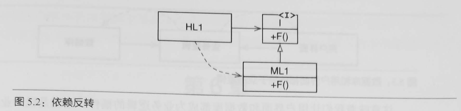
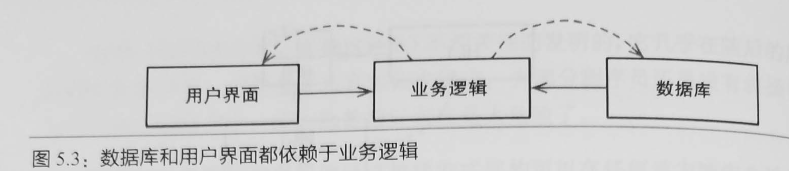

# 目录
- [目录](#目录)
- [第3章 编程范式总览](#第3章-编程范式总览)
- [第4章 结构化编程](#第4章-结构化编程)
- [第5章 面向对象编程](#第5章-面向对象编程)
- [第6章 函数式编程](#第6章-函数式编程)

# 第3章 编程范式总览
> 结构化编程
+ 结构化编程对程序控制权的直接转移进行了限制和规范。
> 面向对象编程
+ 面向对象编程对程序控制权的间接转移进行了限制和规范。
> 函数式编程
+ 函数式编程对程序中的赋值进行了限制和规范。
  
# 第4章 结构化编程
> 功能性降解拆分
+ 结构化编程范式可以将模块递归降解拆分为可推导的单元，这意味着模块也可以按功能进行降解拆分。

# 第5章 面向对象编程
> 依赖反转
+ 
+ 无论我们面对怎样的源代码级别的依赖关系，都可以将其反转。
+ 
>小结
  + 面向对象编程就是以多态为手段来对源代码中的依赖关系进行控制的能力，这种能力让软件架构师可以构建出某种插件式架构，让高层策略性组件与底层实现性组件相分离，底层组件可以被编译成插件，实现独立于高层组件的开发和部署。
# 第6章 函数式编程
> *$\color{blue} {所有的竞争问题、死锁问题、并发更新问题都是由可变变量导致的}$*
+ 由于状态的修改会导致一系列并发问题的产生，所以我们通常会采用某种事务型内存来保护可变变量，避免同步更新和竞争状态的发生。
> 小结：计算机程序无一例外是由顺序结构、分支结构、循环结构和间接转移这几种行为组合而成。