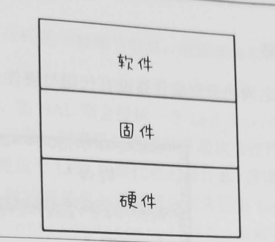
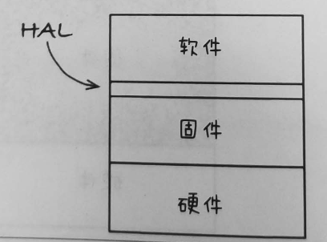
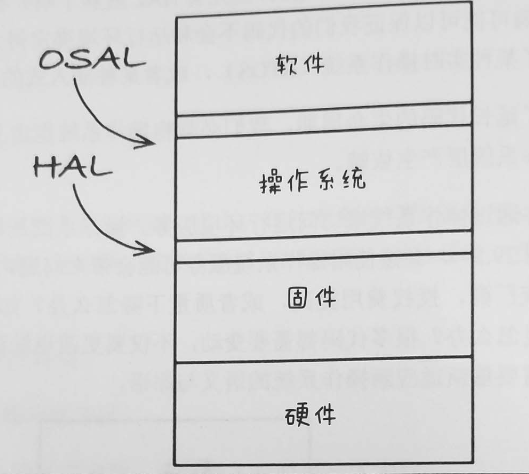

# 第15章 什么是软件架构

> 软件架构师其实是能力最强的一群程序员，他们通常会在自身承担编程任务的同时，逐渐引导整个团队向一个能够最大化生产力的系统设计方向前进。

# 第29章 整洁的嵌入式架构

> 软件构建的三个阶段

+ 先让代码工作起来
+ 对代码进行重构
+ 试着让它运行更快

> 整洁的嵌入式架构就是可测试的嵌入式架构

+ 分层
  + 硬件必须与系统其他部分分隔开
  + 软件与固件集成在一起属于设计上的反模式

> 硬件是实现细节

+ 软件与固件之间的边界被称为硬件抽象层HAL
  + HAL层是按照应用层的需要来提供服务的。

> 操作系统是实现细节

+ 操作系统抽象层
