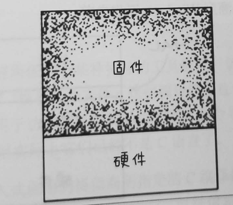

# 第15章 什么是软件架构

> *$\color{blue} {软件架构的实质就是规划如何将系统切分成组件，并安排好组件之间的排列关系，以及组件之间互相通信的方式。}$*

> 软件架构师其实是能力最强的一群程序员，他们通常会在自身承担编程任务的同时，逐渐引导整个团队向一个能够最大化生产力的系统设计方向前进。

> 软件架构设计的主要目标是支撑软件系统的全生命周期，设计良好的架构可以让系统便于理解、易于修改、方便维护，并且能轻松部署。软件架构的最终目标就是最大化程序员的生产力，同时最小化系统的总运营成本。

> 保持可选项

+ 所有的软件系统都可以降解为策略与细节这两种主要元素。
  + 策略体现的是软件中所有业务规则与操作过程，是系统真正的价值所在。
  + 细节则是与策略进行交互但是又不会影响到策略本身的行为。包括I/O设备、数据库等。
  + *$\color{red}{ 软件架构师的目标是创建一种系统形态，该形态会以策略为最基本的元素，并让细节与策略脱离关系，以允许在具体的决策过程中推迟或延迟与细节相关的内容。}$*

# 第16章 独立性

> 一个设计良好的软件架构必须支持以下几点：

+ 系统的用例与正常运行
+ 系统的维护
+ 系统的开发
+ 系统的部署

> 保留可选项

+ 我们正确地将系统给划分为一些隔离良好的组件，为未来留下尽可能多的可选项，让系统在任何时候都能方便地做出必要的变更。

> 按层解耦

+ 一个系统被解耦成若干个水平分层
  + UI界面、应用独有的业务逻辑、领域普适的业务逻辑、数据库等。

> 用例的解耦

+ 按照用例垂直切分

> 解耦的模式

> 开发的独立性

> 部署的独立性

+ 按用例和分层的解耦会给系统带来极大的灵活性。

> 重复

+ 沿着不同路径的相同代码，若干工作日后，可能变化非常大，重复也是有必要。

> 再谈解耦模式

+ 源码层次
  + 源代码模块的依赖关系
+ 部署层次
  + 部署单元之间的依赖关系
+ 服务层次
  + 组件间的依赖关系降低到数据结构级别

> 小结

+ **一个系统所适用的解耦模式可能会随着时间而变化**，优秀的架构师应该能预见这一点，并且做出相应的对策。

# 第17章 划分边界

> 项目初期划分边界的目的是方便我们把一些决策延后，并确保这些决策不会对系统的核心业务逻辑产生干扰。

> 最消耗人力资源的是耦合

> 一个设计良好的系统架构不应该依赖于那些决策与系统的业务需求无关，尽可能地推迟这些细节性的决策，并致力于推迟所产生的影响降到最低。

# 第19章 策略与层次

# 第29章 整洁的嵌入式架构

> 软件构建的三个阶段

+ 先让代码工作起来
+ 对代码进行重构
+ 试着让它运行更快

> 整洁的嵌入式架构就是可测试的嵌入式架构

+ 分层
  + 硬件必须与系统其他部分分隔开
  + 软件与固件集成在一起属于设计上的反模式

> 硬件是实现细节

+ 软件与固件之间的边界被称为硬件抽象层HAL
  + HAL层是按照应用层的需要来提供服务的。

> 操作系统是实现细节

+ 操作系统抽象层
