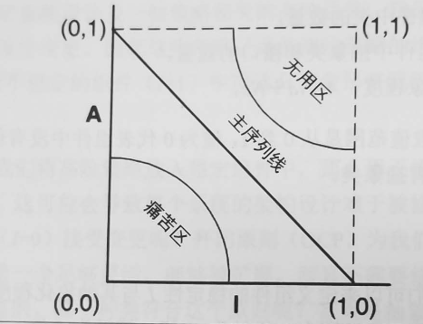
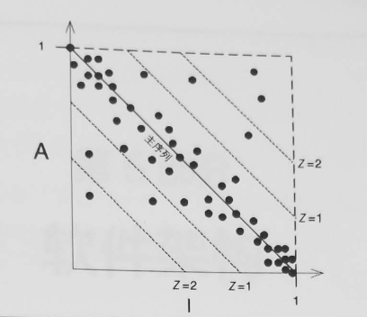

**目录**

- [第12章 组件](#第12章-组件)
- [第13章 组件聚合](#第13章-组件聚合)
- [第14章 组件耦合](#第14章-组件耦合)
  - [**消除循环依赖**](#消除循环依赖)
  - [**自上而下的设计**](#自上而下的设计)

> SOLID原则主要是建房间，组件构建原则主要是把房间组合成房子

# 第12章 组件

> 程序运行时插入某些动态链接文件，这些动态链接文件所使用的就是软件架构中的组件概念。

# 第13章 组件聚合

> 三个与构建组件相关的基本原则:

+ REP: 复用/发布等同原则 The Reuse/Release Equivalence Principle
  + 一个组件中的类与模块必须是彼此紧密相关的。
  + 一个组件不能由一组毫无关联的类和模块组成，它们之间应该由一个共同的主题或大方向。
+ CCP: 共同闭包原则      The Common Closure Principle
  + 将由于相同原因而修改，并且需要同时修改的东西放在一个组件。将由于不同原因而修改，并且不同时修改的东西分开，放到不同组件中。
+ CRP: 共同复用原则      The Common Reuse Principle
  + 将经常共同复用的类和模块放在同一个组件中，不是紧密相连的类不应该被放在同一个组件中。

> 组件的构成安排应随着项目重心的不同，以及研发性与复用性的不同而不断演化。

# 第14章 组件耦合	

> 影响组件结构的不仅有技术水平和公司内部政治斗争这两个因素，其结构本身更是不断变化的。

## **消除循环依赖**

+ 将研发项目划分为一些可单独发布的组件，这些组件可以交由单人或者某一组程序员来独立完成。
+ 控制好组件之间的依赖关系，绝对不允许该结构中存在着循环依赖关系。
+ 根据各部分之间的依赖关系，从最底层的被依赖关系到最高层依次测试发布，构建整套系统。

## **自上而下的设计**

> 组件依赖结构图不是用来说明应用程序功能的，不能在开发初级阶段设计出来，只能随着项目的逻辑设计一起扩张和演进。    

## 稳定依赖原则

> 依赖关系必须指向更稳定的方向。
>
> *I = Fan-out/(Fan-in+Fan-out)*
>
> 组件结构依赖图中各组件的 *I*指标必须按其依赖关系方向递减
>
> 

**稳定抽象原则**

+ 一个组件的抽象化程度应该与其稳定性保持一致
+ 依赖关系应该指向更抽象的方向
+ 抽象程度：*A = Na/Nb*
+ 
+ 离主序列线的距离
  + 距离*D*指标：*D=|A + I - 1|*
  + 
